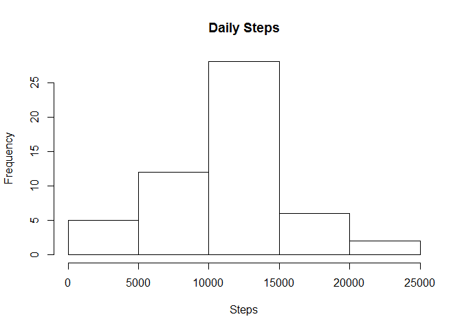
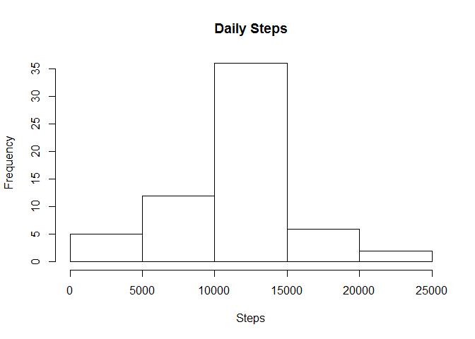
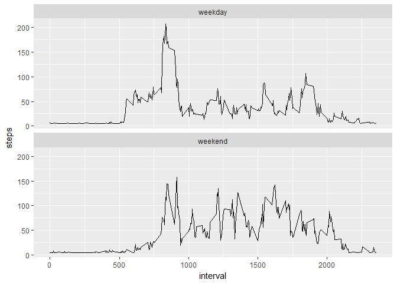

# Reproducible Research: Peer Assessment 1


## Loading and preprocessing the data

Load the data from the csv file


```r
library(ggplot2)
originalData <- read.csv(file = "C:/Users/kevin/Documents/GitHub/RepData_PeerAssessment1/activity/activity.csv", header=TRUE)  
```

Remove any incomplete data


```r
myData <- na.omit(originalData)
```

## What is mean total number of steps taken per day?

Aggregate the data by date and plot the results


```r
dailySteps <- aggregate(x = myData$steps, by = list(date = myData$date), FUN = sum) 
colnames(dailySteps) <- c("date", "steps")
hist(x = dailySteps$steps, main = "Daily Steps", xlab = "Steps")
```

<!-- -->

Calculate the mean


```r
mean(dailySteps$steps)
```

```
## [1] 10766.19
```

Calculate the median


```r
median(dailySteps$steps)
```

```
## [1] 10765
```

## What is the average daily activity pattern?

Plot the averages for each interval

```r
avgDailyData <- aggregate(x = myData$steps, by = list(interval = myData$interval), FUN = mean)
colnames(avgDailyData) <- c("interval", "steps")
ggplot(avgDailyData, aes(x = interval, y = steps)) + geom_line()
```

<!-- -->
  
Determine which daily interval has the most steps on average

```r
maxSteps <- which.max(avgDailyData$steps)
avgDailyData$interval[maxSteps]
```

```
## [1] 835
```


## Imputing missing values

Compute the number of missing values


```r
sum(is.na(originalData$steps))
```

```
## [1] 2304
```

Impute the missing values using the mean for all intervals and plot the results


```r
library(ParamHelpers)
library(mlr)
impData <- impute(originalData, classes = list(integer = imputeMean(), factor = imputeMode()), dummy.classes = "integer")
newData <- impData$data
impDailySteps <- aggregate(x = newData$steps, by = list(date = newData$date), FUN = sum)
colnames(impDailySteps) <- c("date", "steps")
hist(x = impDailySteps$steps, main = "Daily Steps", xlab = "Steps")
```

<!-- -->

Imputing using the mean value has caused the center bar in the graph to be larger while the other bars remained the same.  This makes sense since imputing using the mean is effectively filling in all missing data as if they were average days, thus increasing the number of average days.


Calculate the mean


```r
mean(impDailySteps$steps)
```

```
## [1] 10766.19
```

Calculate the median


```r
median(impDailySteps$steps)
```

```
## [1] 10766.19
```

Imputing the data has not affected the mean number of steps per day.  However, the imputed means have now also become the median value.

## Are there differences in activity patterns between weekdays and weekends? 

Create a column "dayType" in the dataset indicating whether it's a weekday or a weekend


```r
newData$dayType = ifelse(weekdays(as.Date(newData$date)) %in% c("Saturday", "Sunday"), "weekend", "weekday")
```

Plot a comparison of weekdays and weekends


```r
impAvgData <- aggregate(x = newData$steps, by = list(interval = newData$interval, dayType = newData$dayType), FUN = mean)
colnames(impAvgData) <- c("interval", "dayType", "steps")
ggplot(data = impAvgData, aes(x = interval, y = steps)) + geom_line() + facet_wrap(~ dayType, ncol = 1)
```

<!-- -->

We can see that the weekend activity is spread more evenly throughout the day and tends to occur later in the day.
